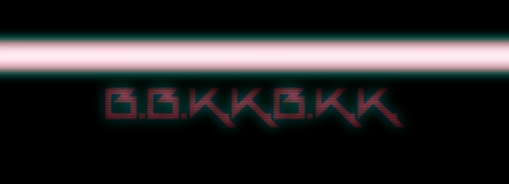
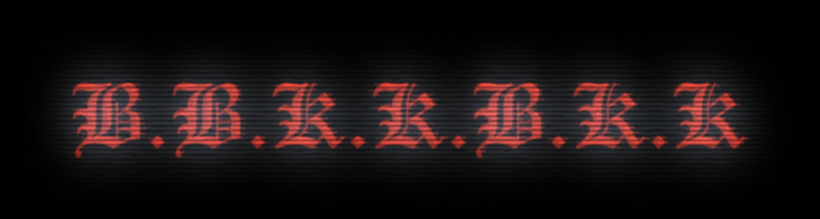

# 通过模仿制作 B.B.K.K.B.K.K BGA 学习 AE 的日记
 未经允许禁止转载！

## 日记记录约定
 正文用于记录（日记）
 > 引用用来记录在 AE 中的操作和状态

## 之前
 之前是瞎试，想做一种玻璃在镜头前的那种效果，在过程中偶然发现了一些其他好用的效果但忘记记录，以至于有时候真的想用某种效果的时候只记得曾经折腾出来过而又不记得具体做了些啥，所以现在选择一个固定的视频进行模仿，然后在其中发现的一些效果的制作方法记录下来，日后再使用或者再看的时候可能会有不一样的收获。

## 第一个镜头
 原视频：  
   
 满屏的大白条(略微偏红)扫描效果，标题有随机的小幅度抖动，字体发光，有电视扫描线效果  

 并不知道他使用的是啥字体，于是我随意选了一个花体吧应该（，先不管最上层的那啥... 叫啥呢，光柱？先把下面的基本效果尝试做出来。  
 之前记得整玻璃效果的时候发现了一个可以移动隔行或者隔列的像素的效果来着...可是现在完全想不起来是用啥做的 orz。

 > * 添加文字 
 > * 转换为图形，删除原文字层，添加 `Fill`
 > * 添加 `Glow` 并调整发光参数
 > * 添加 `Fast Blur`
 > * 为 `Position` 添加 `Wiggle`
 >
 > 我还给图层的 `Fill` 的 `Color` 给了个表达式，大概就是让颜色在一定程度内不规则的变动一下,主要就是原本的红色调附近。

 折腾了好久依旧找不到之前似乎做出来过的效果，于是又开始在 `stylize` 和 `noise` 里找一些能用的效果，于是找到了还挺不错的效果，大致步骤如下：

 > * 创建调整层
 > * 添加 `Brush Strokes`，调整效果
 >      * 主要一个关键的把 `Paint Surface` 改为了 `Paint On Black`
 >      * 其他参数都是看心情调的
 > * 添加 `Fast Blur`

 结合上面两个图层，`Scene1` 的大致感觉已经出来得差不多了。  
 看起来一本满足：  
   
 今天就先到这吧...  
 Recorded in 2017-4-13 02:09:58

---
